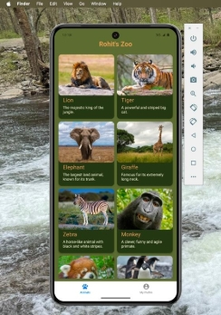
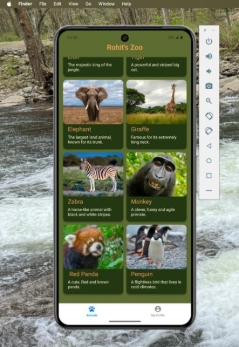
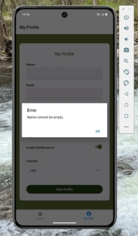

INFO 670 Cross Platform Mobile Application Development 

Assignment -3 \
Title: MyGalleryApp 

Submitted by Rohit Nadimpalli 

**Github Link :  Design and Purpose** 

I always loved zoo since my childhood and I loved exploring animals, so when we wanted to create a galley. I wanted to create a Zoo App. 

For this assignment, I created a basic **Gallery App** where users can **View** **animal gallery**, **Animal pictures in full screen**, and **texts. User can edit his profile.** 

**Target Audience:** Visitors. 

***Basic Use*** 

The app is simple to use. Users can: 

- **View Gallery View of Animals** 
- **View Animals in Full screen** 
- **Edit user profile** 

**Things created:** 

1. A Gallery screen showing a list of pictures each with a thumbnail and caption/title. 
1. A Picture Viewing screen showing the full image once a picture is pressed on the gallery screen along with back button. 
1. A third Profile screen to view and edit the user profile. (5 inputs, save button, used “AsyncStorage”) 
1. Did error Handling 
1. Created a theme and did styling 
1. README.md 

**Screenshot 1:**  Gallery View of the application 

**Screenshot 2:**  Picture Viewer with Caption/Title 

**Screenshot 3:** Profile Page 

**Screenshots 4 & 5: Error Handling** 

These show how the app handles **error checking**—including cases like  **void entries**. 

**Screenshot 6: Profile saved Successful screen **

**Styling**:  

I have created a forest zoo theme with greens. 

[ref1]: Aspose.Words.ed037dc9-7c3b-41f7-a1ac-9113589c596d.001.png
